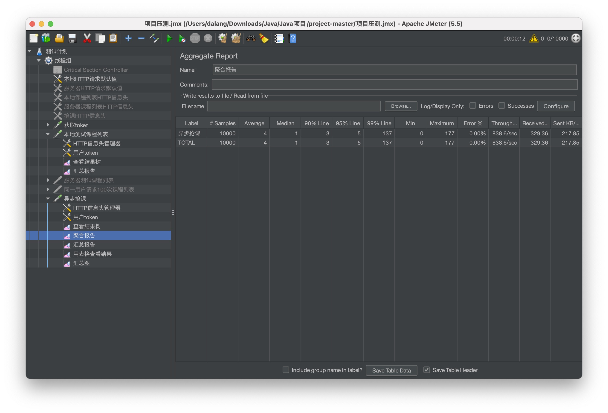

## course_grab 高并发抢课系统

本项目 fork 自 [抢课系统 @Author YiMing-Chris](https://github.com/YiMing-Chris/project)，做了如下fix和优化

- 原项目有依赖版本问题。这里更换了更新的springboot版本
- 原项目使用了Hibernate和Javax的相关注解，但并没有引入相关依赖。因为相关功能并不核心，这里直接删除了相关注解
- 原项目的抢课接口存在超抢问题，redis的余量会小于0，而mysql的余量远大于0，存在很大的数据不一致性问题，真正抢到课的学生较少。这里使用了Lua脚本保证redis的读库存和减库存的原子性，并且在消费者端使用了分布式锁，防止超抢以及一人多抢问题
- 原项目中rabbitmq没有配置交换机和队列的bind，导致消息无法被消费。这里在rabbitmq的管理界面采取了手动bind
- 原项目中rabbitmq消费者端采用的是自动ack。这里使用了手动ack，提升消息消费的可靠性

## 实测数据

测试机器：MacBook Pro，芯片 M1 Pro 10核 CPU，内存 16GB，操作系统 MacOS Ventura 13.0.1

10000 名学生同时抢容量为 80 的课程的测试结果：

